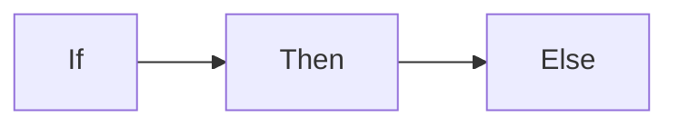

+++
date = '2024-12-21T08:52:05+08:00'
draft = false
title = 'Shortcode'
weight = 919
author = 'Liang'
location = '北京, 昌平'
tags = ["hugo"]
categories = ["工具"]
LastModifierDisplayName = 'Liang'
LastModifierEmail = 'icdb37@163.com'
menuPre = "<i class='fa-solid fa-code'></i> "
headingPre = ''
[mstate]
  mood = ['平常心','忧多喜少']
  weather = '晴天'
  temperature = '-6~5'
  festival = '冬至'
  poetryMe = ['之前与现在无数个有意识与下意识的选择决定了当前和未来的我，我是我么？']
  poetryHe = ['']
+++

## 徽章
语法：`{}Important{}`
* 开始标记：`{}` 结束标记：`{}`
* 样式：`style`
    * 等级类型：`caution`, `important`, `info`, `note`, `tip`, `warning`
    * 标识颜色：`primary`, `secondary`, `accent`
    * 背景颜色：`blue`, `cyan`, `green`, `grey`, `magenta`, `orange`, `red`
    * 特殊颜色：`default`, `transparent`, `code`
* 标题：`title` 前部文本
* 图标：`icon` 前部文本前图标
* 内容：`{}`与`{}` 之间的文本

示例：
* {}Important{} -> ``` {}Important{} ```
* {}6.6.6{} -> `{}6.6.6{}`
* {}Captain{} -> `{}Captain{}`
* {}New{} -> `{}New{}`
* {}Awesome{} -> `{}Awesome{}`
* {}注意{} -> `{}Captain{}`
* {} -> `{}  `


## 按钮
* 格式：`{}Go Hugo{}`
  * href：链接地址
  * style：样式
  * icon：图标
  * iconposition：图标位置，`left`, `right`
  * color：颜色
  * 按钮名称

示例：
* 内部链接：{}Home{}（主页） -> `{}Home{}`
* 执行js：{}提示框{}（提示） -> `{}Shout it out{}`

## 层级
显示子文档：`{}`
* containerstyle：默认为`ul`，支持：`div`
* style：默认为`li`，支持：`div`
* showhidden：是否展示隐藏文档，默认为`false`
* description：展示描述，默认为`false`
* depth：层级深度，默认为`1`
* sort：文章/章节排序方式，默认`auto`，支持：`weight`, `title`, `modifieddate`, `expirydate`, `publishdate`, `date`, `length`

## 扩展
格式：{}Thank you!{} -> `{}Thank you!{}`
* title：标题，默认为`Expand me...`
* expanded：内容是否展开，默认为`false`
* 内容

## 高亮
语法：`print("Hello World!")`
* type：语法类型
  * py
  * sh
  * c
  * 等等
* title：代码标题
* wrap：封装，true展示全部（太长文本自动换行），否则滚动条
* 其它可选项
  * lineNumbersInTable：代码块渲染时添加行号，默认为`true`
  * lineNos：展示行号
  * lineNoStart：其实行号
  * hl_lines：代码块高亮行号，与起始行无关


# Quicksort Python One-liner
lambda L: [] if L==[] else qsort([x for x in L[1:] if x< L[0]]) + L[0:1] + qsort([x for x in L[1:] if x>=L[0]])
# Some more stuff


```

# Quicksort Python One-liner
lambda L: [] if L==[] else qsort([x for x in L[1:] if x< L[0]]) + L[0:1] + qsort([x for x in L[1:] if x>=L[0]])
# Some more stuff

```

## 图标
语法：`{}`
* icon：图标名称
[免费图标](https://fontawesome.com/v6/search?o=r&m=free)

<!--
## 导入markdown
语法：`{}`
* file：导入其它`markdown`文件到当前页面

{}
-->

## 数学
语法：` $$\left( \sum_{k=1}^n a_k b_k \right)^2 \leq \left( \sum_{k=1}^n a_k^2 \right) \left( \sum_{k=1}^n b_k^2 \right)$$ `
* align：对齐方式，支持：`left`,`center`,`right`
* 内容为latex语法

示例：  

$$\left( \sum_{k=1}^n a_k b_k \right)^2 \leq \left( \sum_{k=1}^n a_k^2 \right) \left( \sum_{k=1}^n b_k^2 \right)$$

```md

$$\left( \sum_{k=1}^n a_k b_k \right)^2 \leq \left( \sum_{k=1}^n a_k^2 \right) \left( \sum_{k=1}^n b_k^2 \right)$$

```

Euclid already knew, $\sqrt{2}$ is irrational.

````md
Euclid already knew, $\sqrt{2}$ is irrational.
````


## 图表
语法：  
````md

````
* align：对齐方式，支持：`left`,`center`,`right`
* zoom：是否支持缩放，默认从系统配置mermaidZoom获取，或者false
* 页面配置添加
```
[mermaid]
  force = true
```
* 图表类型：
  * graph：流程图
  * sequenceDiagram：时序图
  * classDiagram：类图
  * stateDiagram：状态图
  * erDiagram：ER图（实体关系图）
  * journey：历程图
  * gantt：甘特图
  * pie：饼图
  * quadrantChart：象限图
  * requirementDiagram：需求图
  * gitGraph：git提交图
  * mindmap：思维导图
  * timeline：时间线
  * xychart-beta：坐标折线图
  * block-beta：块图
  * packet-beta：协议图
  * kanban：看板
  * architecture-beta：架构图

## 注意
语法：`{}It is all about the boxes.{}`
* style：样式，默认为`default`
  * 等级：`caution`, `important`, `info`, `note`, `tip`, `warning`
  * 标题图标：`primary`, `secondary`, `accent`
  * 标题颜色：`blue`, `cyan`, `green`, `grey`, `magenta`, `orange`, `red`
  * 特殊颜色：`default`, `transparent`, `code`
* title：标题内容
* icon：标题图标
* groupid：组标识，同一个组之间共享打开状态，默认为空值
* color：内容颜色
* expanded：是否展开，默认展开
* 内容：支持markdown渲染


如果展示没边框提示框，可以使用`expand`；  
简单提示可以使用`callout`，例如：
```
> [!primary]- There may be pirates
> It is all about the boxes.
```
> [!primary]- There may be pirates
> It is all about the boxes.

```
> [!info] Can callouts be nested?
> > [!important] Yes!, they can.
> > > [!tip]  You can even use multiple layers of nesting.
```
> [!info] Can callouts be nested?
> > [!important] Yes!, they can.
> > > [!tip]  You can even use multiple layers of nesting.

## api接口
语法：``

swagger文件渲染

## 资源
语法：`{}`
* style：样式，默认为`transparent`
  * 等级：`caution`, `important`, `info`, `note`, `tip`, `warning`
  * 标题图标：`primary`, `secondary`, `accent`
  * 标题颜色：`blue`, `cyan`, `green`, `grey`, `magenta`, `orange`, `red`
  * 特殊颜色：`default`, `transparent`, `code`
* title：标题内容
* icon：标题图标
* groupid：组标识，同一个组之间共享打开状态，默认为空值
* color：标题颜色
* expanded：是否展开，默认展开
* sort：默认为`asc`（文件大小从小到大），支持：`asc`, `desc`
* pattern：匹配模式，例如：`.*\.jpg`
* 内容：支持markdown渲染

## 选项卡
语法(tab)：`{}printf("Hello World!"){}`
* style：样式，默认为`transparent`
  * 等级：`caution`, `important`, `info`, `note`, `tip`, `warning`
  * 标题图标：`primary`, `secondary`, `accent`
  * 标题颜色：`blue`, `cyan`, `green`, `grey`, `magenta`, `orange`, `red`
  * 特殊颜色：`default`, `transparent`, `code`
* title：标题内容
* color：标题颜色
* icon：标题图标

语法(tabs)：` ... `
* groupid：分组标识，相同组具有相同的选项卡选择，默认为随机值
* style：样式同tab的style
* color：标题内容颜色
* title：标题内容
* icon：标题前图标
* 内容：多个tab数据，tab下可以添加其它tabs；



{}

````go

{}
```python
print("Hello World!")
```
{}
{}
```bash
echo "Hello World!"
```
{}
{}
```c
printf"Hello World!");
```
{}

````

{}
{}

````go
{{ partial "shortcodes/tabs.html" (dict
  "page"  .
  "title" "hello."
  "content" (slice
    (dict
      "title" "py"
      "content" ("```python\nprint(\"Hello World!\")\n```" | .RenderString)
    )
    (dict
      "title" "sh"
      "content" ("```bash\necho \"Hello World!\"\n```" | .RenderString)
    )
    (dict
      "title" "c"
      "content" ("```c\nprintf(\"Hello World!\");\n```" | .RenderString)
    )
  )
)}}
````

{}



{}

```python
print("Hello World!")
```

{}
{}

```bash
echo "Hello World!"
```

{}
{}

```c
printf("Hello World!");
```

{}
